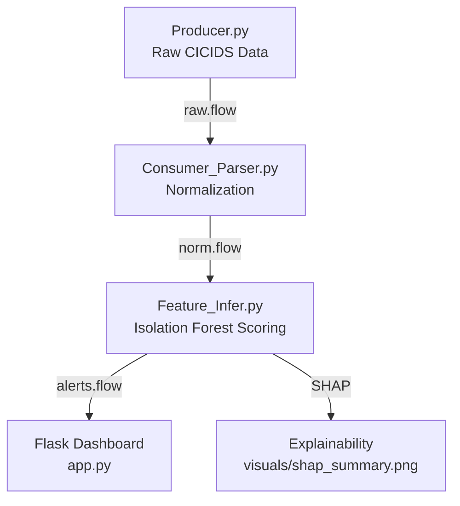

---

# Adaptive AI-Based Intrusion Detection System

**CSE543 – Group Project**
**Lead Author:** Praneeth Krishna Palle

---

## 1. Install and Configure Docker

### 1.1 Install Docker Desktop

Download and install Docker from the official site:
[https://www.docker.com/products/docker-desktop/](https://www.docker.com/products/docker-desktop/)

After installation, verify Docker is running:

```bash
docker --version
```

You should see something like:

```
Docker version 27.0.3, build ...
```

---

## 2. Start Kafka and Zookeeper Using Docker

Navigate to the Kafka folder in your project:

```bash
cd kafka
```

Run the containers:

```bash
docker-compose up -d
```

Check active containers:

```bash
docker ps
```

You should see:

```
zookeeper   confluentinc/cp-zookeeper:7.6.0
kafka       confluentinc/cp-kafka:7.6.0
```

Stop Kafka (if needed):

```bash
docker-compose down
```

---

## 3. Resetting Kafka Topics (Start Fresh)

If you want to **remove existing topics** and start clean:

### 3.1 Delete Existing Topics

```bash
docker exec -it kafka kafka-topics --bootstrap-server localhost:9092 --delete --topic raw.flow
docker exec -it kafka kafka-topics --bootstrap-server localhost:9092 --delete --topic norm.flow
docker exec -it kafka kafka-topics --bootstrap-server localhost:9092 --delete --topic alerts.flow
```

### 3.2 Recreate the Topics

```bash
docker exec -it kafka kafka-topics --bootstrap-server localhost:9092 --create --topic raw.flow --partitions 1 --replication-factor 1
docker exec -it kafka kafka-topics --bootstrap-server localhost:9092 --create --topic norm.flow --partitions 1 --replication-factor 1
docker exec -it kafka kafka-topics --bootstrap-server localhost:9092 --create --topic alerts.flow --partitions 1 --replication-factor 1

docker exec -it kafka kafka-topics --list --bootstrap-server localhost:9092
```

---

## 4. Set Up the Python Environment

### 4.1 Create and Activate a Virtual Environment

```bash
python -m venv .venv
source .venv/bin/activate        # Windows: .venv\Scripts\activate
```

### 4.2 Install Dependencies

```bash
pip install -r requirements.txt
```

Your `requirements.txt` should include:

```text
pandas==2.2.3
numpy==1.26.4
scikit-learn==1.5.2
joblib==1.4.2
shap==0.44.1
matplotlib==3.9.2
flask==3.0.3
kafka-python==2.0.2
tqdm==4.66.5
pyyaml==6.0.2
```

---

## 5. Prepare Dataset

Download the **CIC-IDS-2017** dataset from
[https://www.unb.ca/cic/datasets/ids-2017.html](https://www.unb.ca/cic/datasets/ids-2017.html)

Place it in:

```
data_original/
```

Then create a 50,000-row sample:

```bash
python data_proc.py
```

This saves:

```
data_processed/CICIDS2017_processed.csv
```

---

## 6. Train the Anomaly Detection Model

Train the **Isolation Forest** model on processed data:

```bash
python src/train_model.py
```

Expected output:

```
Training Isolation Forest on 50000 records...
Model saved at model/isolation_forest.joblib
```

---

## 7. Run the Real-Time Streaming Pipeline

Open **three terminals** (or tabs) and run in this order:

### Terminal 1 – Producer

```bash
python src/producer.py
```

Streams data to topic `raw.flow`.

### Terminal 2 – Parser & Normalizer

```bash
python src/consumer_parser.py
```

Consumes `raw.flow`, cleans the data, and publishes to `norm.flow`.

### Terminal 3 – Model Inference

```bash
python src/utils/feature_infer.py
```

Consumes `norm.flow`, applies the trained model, and publishes anomaly alerts to `alerts.flow`.

Expected output:

```
Isolation Forest model loaded successfully.
Scoring events in real time...
[100] score=-0.214 anomaly=True
```

---

## 8. Explainability with SHAP

Generate the **feature-importance visualization**:

```bash
python src/explain_shap.py
```

A summary plot is saved in:

```
visuals/shap_summary.png
```

This shows which traffic features most influenced the anomaly scores.

---

## 9. Run the Flask Dashboard

In a new terminal:

```bash
python src/app.py
```

Open the dashboard in your browser:

**[http://localhost:5000](http://localhost:5000)**

Features:

* Displays latest 20 alerts (auto-refresh every 3 seconds)
* Shows Time, Source IP, Destination IP, Port, Score, and Anomaly status
* Stores all alerts in `logs/alerts_log.json`
* Old alerts vanish from the dashboard but are saved permanently in logs

---

## 10. File Persistence

Every processed alert is saved automatically as a JSON record in:

```
logs/alerts_log.json
```

Example:

```json
{"timestamp": "2025-11-04 15:52:20", "score": -0.221, "is_anomaly": true, "context": {"Source IP": "10.0.0.1", "Destination IP": "10.0.0.2", "Destination Port": 80}}
```

---

## 11. Architecture Overview



---

## 12. Starting the Entire System from Scratch

If you want a **completely fresh start**, run:

```bash
# Stop running containers
cd kafka
docker-compose down

# Remove old Kafka topics
docker exec -it kafka kafka-topics --delete --topic raw.flow --bootstrap-server localhost:9092
docker exec -it kafka kafka-topics --delete --topic norm.flow --bootstrap-server localhost:9092
docker exec -it kafka kafka-topics --delete --topic alerts.flow --bootstrap-server localhost:9092

# Restart containers
docker-compose up -d

# Recreate topics
docker exec -it kafka kafka-topics --create --topic raw.flow --bootstrap-server localhost:9092 --partitions 3 --replication-factor 1
docker exec -it kafka kafka-topics --create --topic norm.flow --bootstrap-server localhost:9092 --partitions 3 --replication-factor 1
docker exec -it kafka kafka-topics --create --topic alerts.flow --bootstrap-server localhost:9092 --partitions 3 --replication-factor 1

# Delete old logs and visuals (optional)
rm -rf logs/alerts_log.json visuals/shap_summary.png model/isolation_forest.joblib
```

Then repeat the following:

```bash
python data_proc.py
python src/train_model.py
python src/explain_shap.py
python src/producer.py
python src/utils/consumer_parser.py
python src/utils/feature_infer.py
python src/app.py
```

---

## 13. References

* [CIC IDS 2017 Dataset](https://www.unb.ca/cic/datasets/ids-2017.html)
* [Kafka Python Client Documentation](https://kafka-python.readthedocs.io/en/master/)
* [SHAP Library Documentation](https://shap.readthedocs.io/en/latest/)
* [Flask Official Documentation](https://flask.palletsprojects.com/)

---

**Environment:** Python 3.13 + Docker Compose + Confluent Kafka 7.6.0
**IDE:** PyCharm / VS Code
**Date:** Week 3 Implementation — Explainability and Visualization Layer


---

